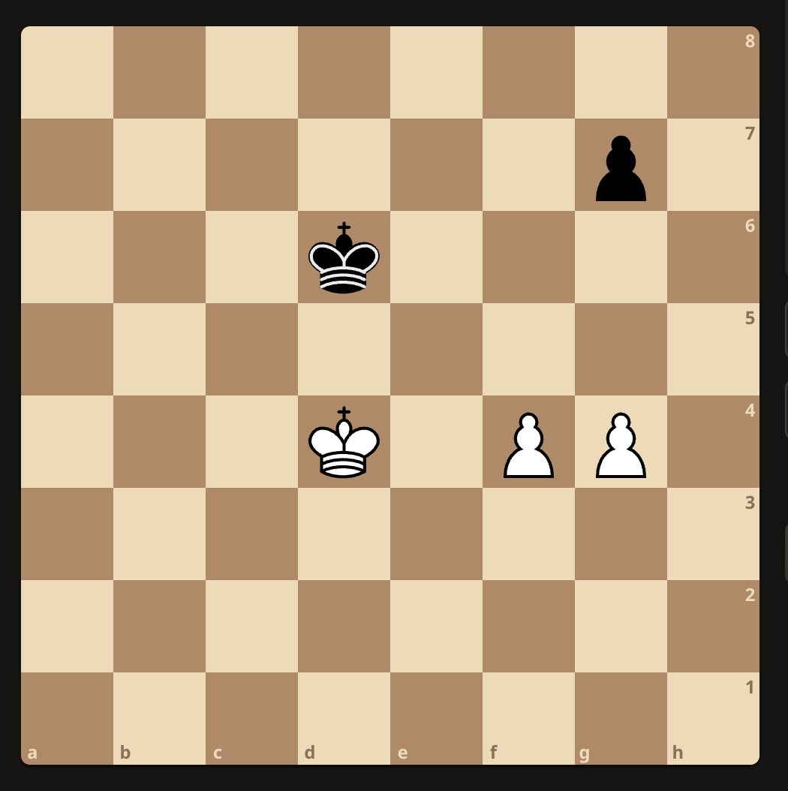
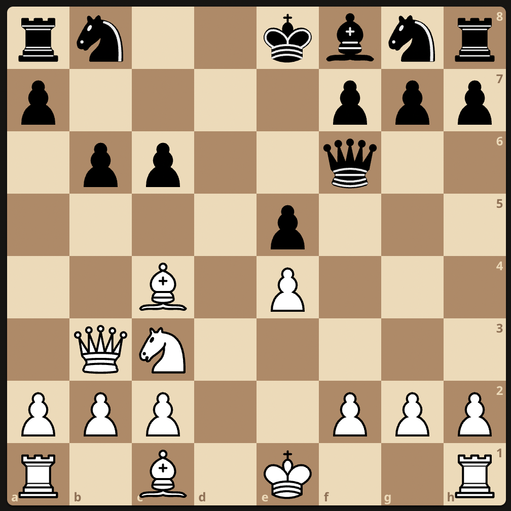

## Chess Fundamentals

### Pawn promotion
White to play:

Ke6 because e6 turns it into a draw.

### Pawn Ending
White to play:

Ke6 because it forces Kh8
1. Ke6 - Kh8
2. f6 - gxf6
3. Kf7 (traps the king but pawn escapes) - f5
4. g7+ - Kh7
5. g8Q+ - Kh6
6. Qg6#   

White to play:

f5 turns it into a draw. Because:
1. f5 - g6
2. fxg6 - Ke6
3. g7 - Kf7
4. Ke4 - Kxg7
5. Kf4 - Kg8
6. g5 - Kg7
7. Kf5 - Kg8
8. g6 - Kg7
9. Kg5 - Kg8
10. Kf6 - Kh8

This results in a locked draw state.    

Winning move here is Ke4 because it supports both the pawn before proceding towards promotion.   

White to play:

1. f5 Ke7   
2. Ke5 Kf7
3. g5 Ke7
4. h5 g6  
5. hxg6 hxg6
6. f6+     
     
In this ending white can win by advancing any one of the pawns.

White to play:

1. g4 a5 (Usually advisable to move the pawn that is free from opposition)
2. a4 Kf6
3. h4 Ke6
4. g5 Kf7
5. Kf5 Kg7
6. h5 Kf7
7. Ke5   (push King to left side to win black pawn)     

This locks the king on top for a while even when king is traversing to the left side of the board.

### Winning middle games

White to play after 1. .. Re8:

1. .. Re8 (Attacks and threatens checkmate)
There are couple of obvious moves to defend this. Qg3 or Bc3 seem like a good moves to defend but there is a forced checkmate missing from the view. That move is     
2. Qxh7 Kxh7
3. Rh3 Kg8
4. Rh8#       
This teaches us to look for bold attack strategies even when you feel like playing defensive instinctively.    

White to play:

The previous strategy of Qxh7 doesn't work here because the sequence follows: 1. Qxh7 Kxh7 2. Rh3 Kg8. This does not work because Kd4 blocks Bb2 from delevering checkmate. If white takes Kxc6, black can play f6 defending against the threat.     
So white must take Nxc6, the bishop cannot take it because there is threat of forced checkmate Qxh7. Here black plays Bg5. The sequence follows:    
1. Nxc6 Bg5
2. Ne7+ Qxe7 (if black plays Bxe3, the Qxh7 sequence leads to a check mate)
3. Rxe7 Bxe7
4. Qd7 ..   
This leads to a situation where either one of bishop is guarenteed to be taken. This puts white in a significant advantage. These example show the dangers of advancing g-pawn one square after casteling to the king side.    

White to play:    

There is a simple forced checkmate here: 1. Kf6+ ..
1. Kf6+ gxf6
2. Qg3 Kg8
3. Bxf6#

White to play:

Here there is a move that forces white to a better position. The sequence follows:    
1. Bxh7 Kxh7
2. Qh5 Kg8
3. Ng5 Qe4 (This forces the black to sacrifice its queen to prevent checkmate.)
4. Nxe4 ...   

White to play:

This is one of the common sequence pattern that is kind of semi forced. 
1. bxd7 Qxd7
2. Kf6 gxf6
3. Rg3+ Kh8
4. Bxf6#

White to play:

1. Bxh7 Kxh7
2. Qh5+ Kg8
3. Ng5 Qe4 (Here black is forced to move Qe4 because there is no other way to stop checkmate)
4. Nxe4 

White to play:

### Relative Value of Pieces

For all general theoretical purposes, the bishop and knight is considered to have equal value. But in some cases knights are better and in relatively more cases bishops are better. The bishop will be stronger against pawns than knights. In combination with pawns will also be stronger against the Rook than the Knight will be.    

A bishop and a rook are also stronger than a knight and a rook, but a queen and a knight may be stronger than a queen and a bishop.    

A bishop will often be worth more than three pawns but a knight very seldom so. 

A rook will be worth a Knight and two pawns, or a bishop and two pawns, but as said before, the bishop will be a better piece against a rook.    

Two rooks are slightly stronger than a queen. They are slightly weaker than two knights and a bishop. They are slightly weaker than two Knights and a Bishop, and a little more so than two Bishops and a Knight.    

The power of the Knight decreases as the pieces are
changed off. The power of the Rook, on the contrary,
increases.    

The king pure becomes defensive during the middlegame. However, the handling of the king becomes of paramount importance once the endgame stage is reached.     

### General Strategy of the Opening

The main thing is to develop pieces quickly. Playing 1. e4 or d4 opens up the line for the queen and a bishop so must be theoritically the best move since no other moves accomplish this. 

1. e4 e5
2. Nf3 .. (Now black can reply with either identical move or respond with) .. Nc6
3. Nc3 Nf6 (These are for purely developing nature.)
4. Bb5 .. (It is advisable that not to bring this bishop out until one of the knight is out, preferablly king's knigh. Bc4 was also possible but it is generally better to develop a piece with an attack) .. B4 (Black threatening with similar line of attck)
5. O-O .. (An indirect approach of preventing Bxc3) .. O-O (Black following similar line of reasoning)
6. d3 d6 (This move has two fold object, viz, to protect the e pawn and open the diagonal for the development of queen's bishop)
7. Bg5 (This brings us very close to the middle game, a very powerful move as there is already in view a combination to win quickly by Nd5, there is a long analysis that black loses if black plays Bg4) Bxc3 (Black is forced to take this capture)  

This brings to light three things:    
**First**, the complete development of the opening has taken only seven moves. As a rule eight moves should be more than enough.     
**Second**, black has been forced to exchange bishop for the knight but as compensation he has isolated white's pawn and doubled a pawn. This, at this early stage of the game, is advantageous for white since the pawn is doubled towards the center of the board.     
**Third**, white by the exchange brings up a pawn to control the square d4, puts the black on defensive, as experience will show.

Before the development has been completed no piece should be moved more than once, unless it is essential in order to obtain material advantage or to secure freedom of action.

### Control of the Centre

The d4, d4, e4 and e5 are the center squares, and control of these squares is called the control of the center. No violent attack can succeed without controlling at least two of these squares, and possibly three. 

1. e4 e5
2. Nf3 d6 (A timid move as black assumes defensive attitude. On principle the move is wrong.)
3. d4 .. (White takes offensive immediately and strives to control the center) .. Nd7 (More natural move for knight would be Nc6, but Nd7 was played which is in principle wrong.) 
4. Bc4 h6 (Black is forced to pay penalty of his previous moves.)
5. Nc3 Ngf6
6. Be3 Be7
7. Qe2 .. (White does not castle first as he wants to deploy his forces first. White also threatens Rd1 with this move) .. c6
8. Rd1 Qc7
9. O-O ..  (With this last move the white completes its development while black is somewhat hampered. White is better here positionally.)

### Control of the Centre

1. e4 e5
2. Nf3 d6
3. d4 Bg4 (A bad move, which violates one of the principles set down to develop atleast a knight before bishops are brought out. And in early games, exchanging bishop for knight is bad idea unless there is a compensation.)
4. dxe5 Bxf3 (4. .. dxe5 loses a pawn)
5. Qxf3 dxe5
6. Bc4 Qf6 (If 6. .. Nf6 1. Qb3 wins a pawn)
7. Qb3 b6
8. Nc3 c6 (To prevent 9. Nd5. Black, however, has no pieces except his queen, and white, with a bishop and a knight already in development and has chance of gaining advantage quickly by playing Nd5 anyway)

### Opening Traps

