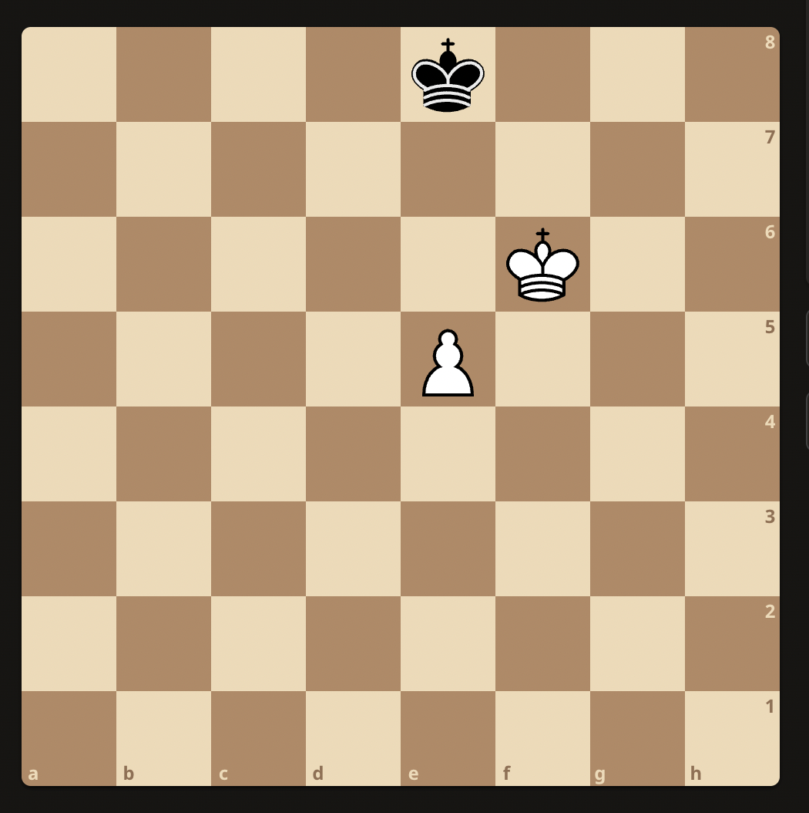

## Chess Fundamentals

### Pawn promotion
White to play:

Ke6 because e6 turns it into a draw.

### Pawn Ending
White to play:

Ke6 because it forces Kh8
1. Ke6 - Kh8
2. f6 - gxf6
3. Kf7 (traps the king but pawn escapes) - f5
4. g7+ - Kh7
5. g8Q+ - Kh6
6. Qg6#   

White to play:

f5 turns it into a draw. Because:
1. f5 - g6
2. fxg6 - Ke6
3. g7 - Kf7
4. Ke4 - Kxg7
5. Kf4 - Kg8
6. g5 - Kg7
7. Kf5 - Kg8
8. g6 - Kg7
9. Kg5 - Kg8
10. Kf6 - Kh8

This results in a locked draw state.    

Winning move here is Ke4 because it supports both the pawn before proceding towards promotion.   

White to play:

1. f5 Ke7   
2. Ke5 Kf7
3. g5 Ke7
4. h5 g6  
5. hxg6 hxg6
6. f6+     
     
In this ending white can win by advancing any one of the pawns.

White to play:

1. g4 a5 (Usually advisable to move the pawn that is free from opposition)
2. a4 Kf6
3. h4 Ke6
4. g5 Kf7
5. Kf5 Kg7
6. h5 Kf7
7. Ke5   (push King to left side to win black pawn)     

This locks the king on top for a while even when king is traversing to the left side of the board.

### Winning middle games

White to play after 1. .. Re8:

1. .. Re8 (Attacks and threatens checkmate)
There are couple of obvious moves to defend this. Qg3 or Bc3 seem like a good moves to defend but there is a forced checkmate missing from the view. That move is     
2. Qxh7 Kxh7
3. Rh3 Kg8
4. Rh8#       
This teaches us to look for bold attack strategies even when you feel like playing defensive instinctively.    

White to play:

The previous strategy of Qxh7 doesn't work here because the sequence follows: 1. Qxh7 Kxh7 2. Rh3 Kg8. This does not work because Kd4 blocks Bb2 from delevering checkmate. If white takes Kxc6, black can play f6 defending against the threat.     
So white must take Nxc6, the bishop cannot take it because there is threat of forced checkmate Qxh7. Here black plays Bg5. The sequence follows:    
1. Nxc6 Bg5
2. Ne7+ Qxe7 (if black plays Bxe3, the Qxh7 sequence leads to a check mate)
3. Rxe7 Bxe7
4. Qd7 ..   
This leads to a situation where either one of bishop is guarenteed to be taken. This puts white in a significant advantage. These example show the dangers of advancing g-pawn one square after casteling to the king side.    

White to play:    

There is a simple forced checkmate here: 1. Kf6+ ..
1. Kf6+ gxf6
2. Qg3 Kg8
3. Bxf6#

White to play:

Here there is a move that forces white to a better position. The sequence follows:    
1. Bxh7 Kxh7
2. Qh5 Kg8
3. Ng5 Qe4 (This forces the black to sacrifice its queen to prevent checkmate.)
4. Nxe4 ...   

White to play:

This is one of the common sequence pattern that is kind of semi forced. 
1. bxd7 Qxd7
2. Kf6 gxf6
3. Rg3+ Kh8
4. Bxf6#

White to play:

1. Bxh7 Kxh7
2. Qh5+ Kg8
3. Ng5 Qe4 (Here black is forced to move Qe4 because there is no other way to stop checkmate)
4. Nxe4 

White to play:

