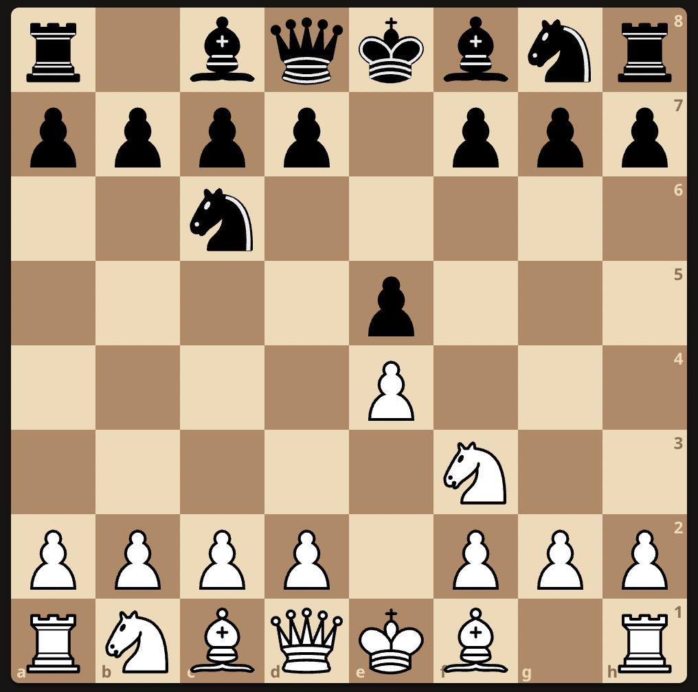
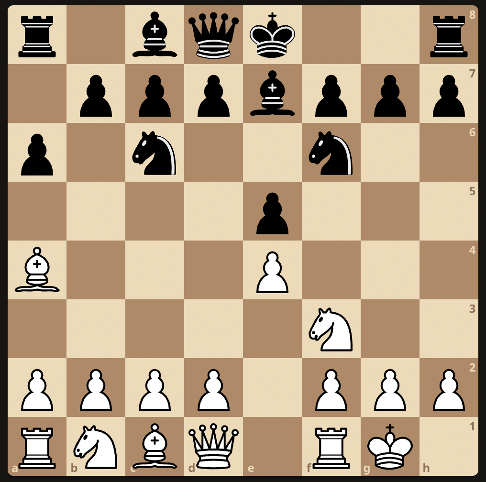
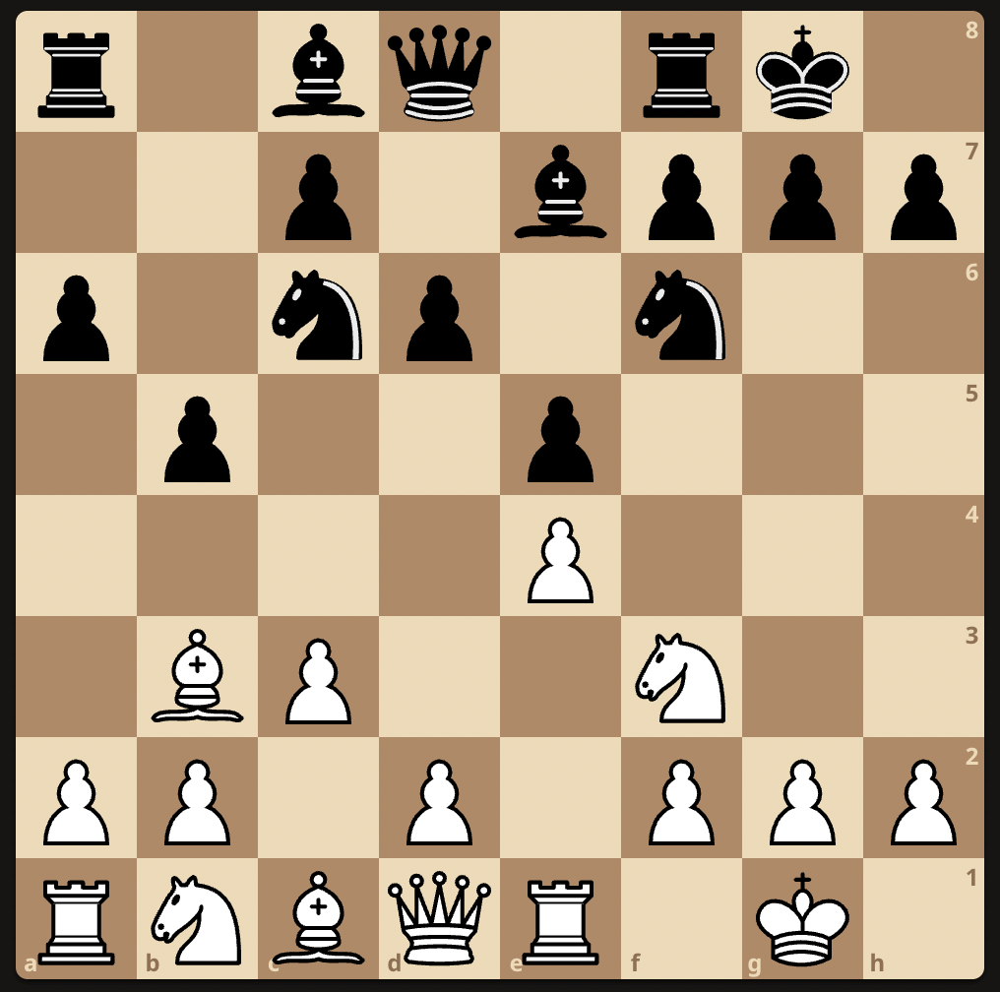
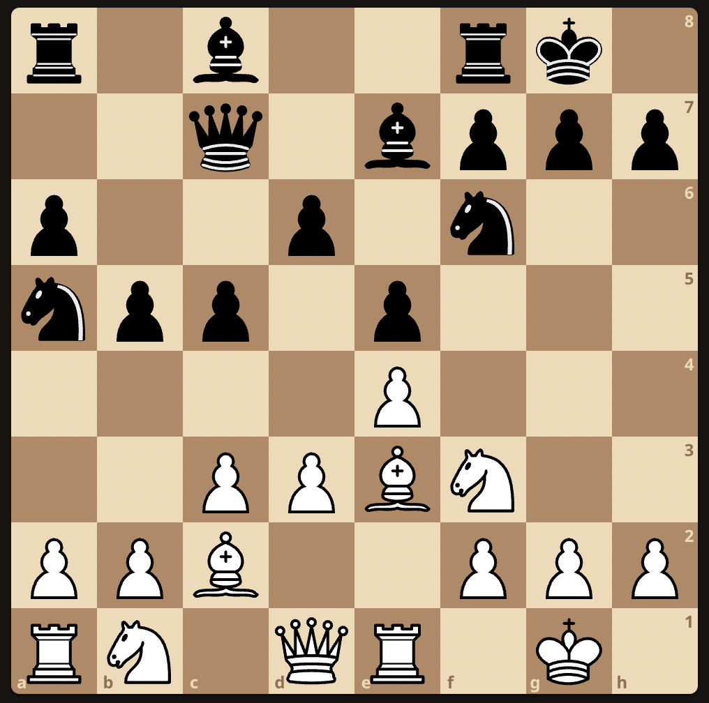
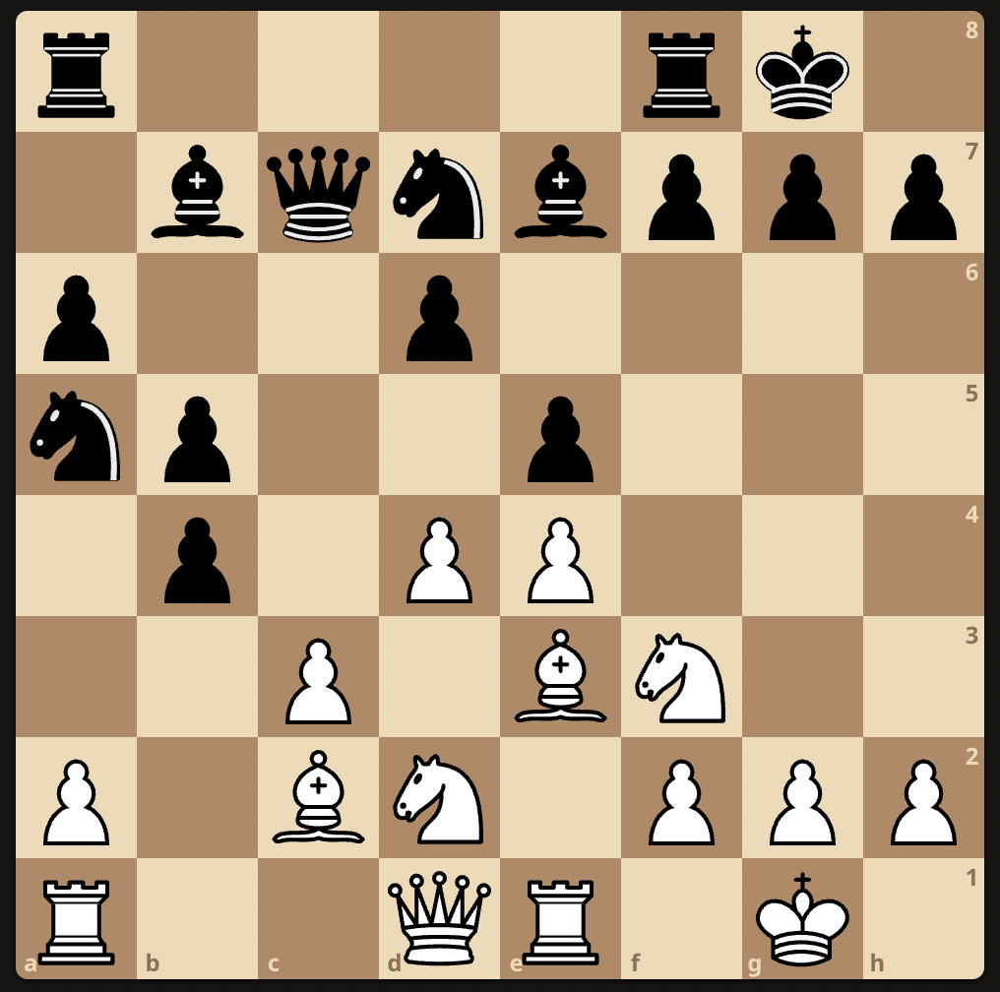

# Mikhail Tal Study

### Black to play: 

Tal plays ..    
1. .. Rxf3   
2. Rxa7 Qxb5
3. gxf3? Qg5+
4. Kh1 Rg8

### Ruy Lopez
***Victor Ivanov vs Tal***  
Latvian Youth Championship (Riga 1950)

1. e4 e5
2. Nf3 Nc6

3. Bb5 a6
4. Ba4 Nf6
5. O-O Be7

6. Re1 b5
7. Bb3 O-O
8. c3 d6

9. d3 Na5
10. Bc2 c5
11. Be3 Qc7

12. Nbd2 Bb7
13. d4 Nd7
14. b4 cxd4?

