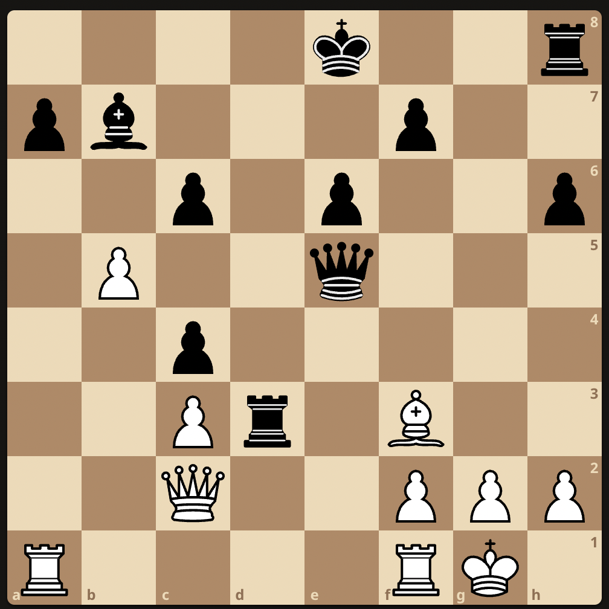
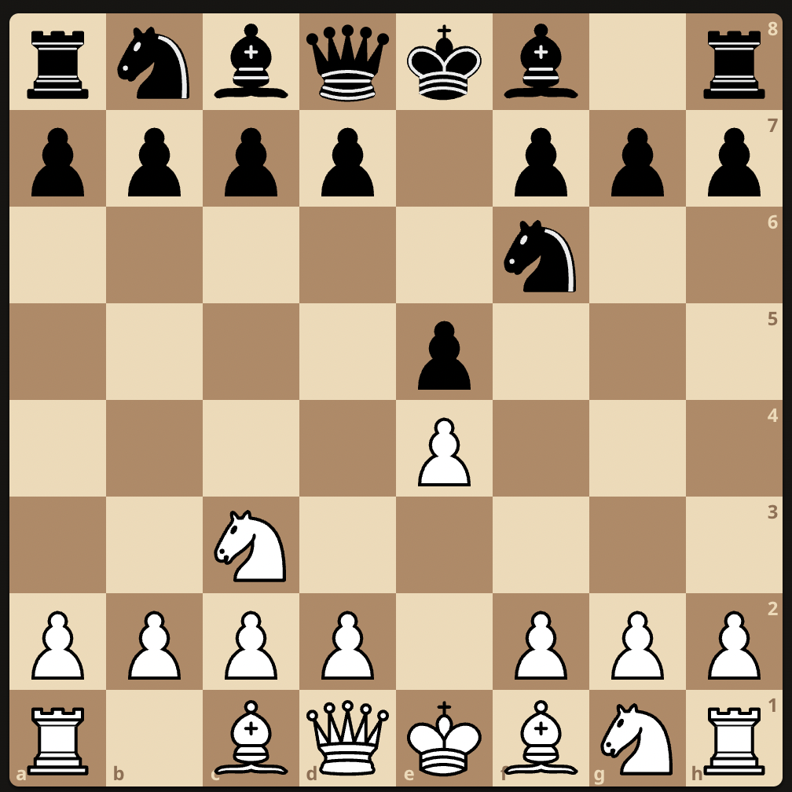

# Mikhail Tal Study

### Black to play: 

Tal plays ..    
1. .. Rxf3   
2. Rxa7 Qxb5
3. gxf3? Qg5+
4. Kh1 Rg8

### Ruy Lopez
***Victor Ivanov vs Tal***  
Latvian Youth Championship (Riga 1950)

1. e4 e5
2. Nc3 Nf6

3. 

