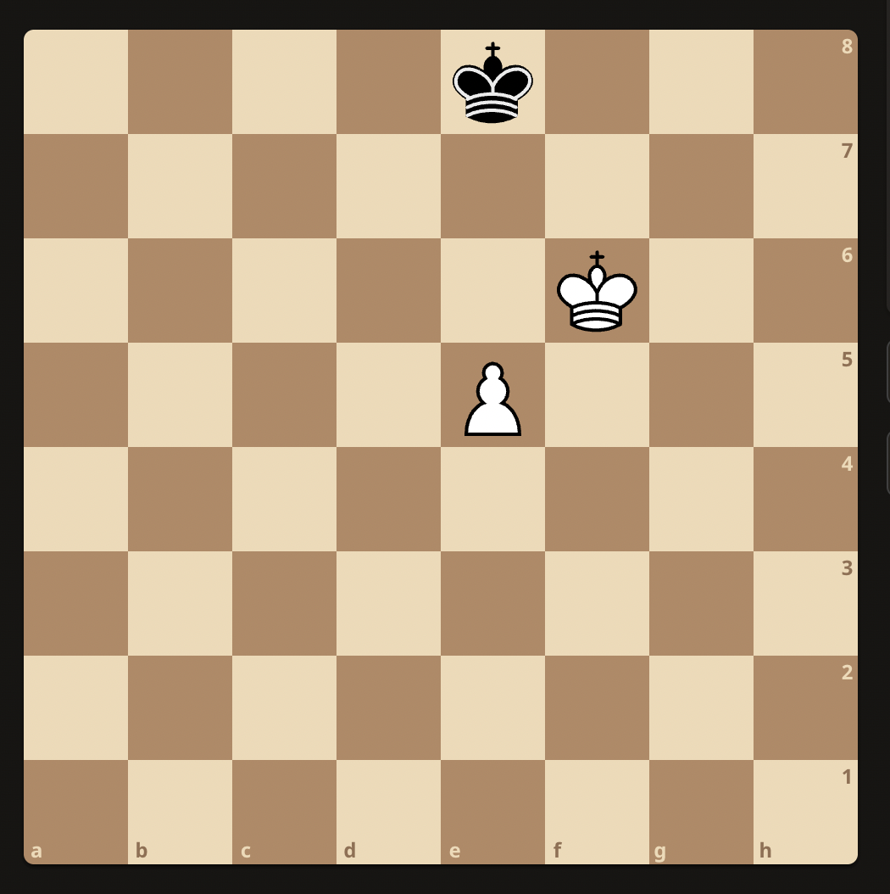
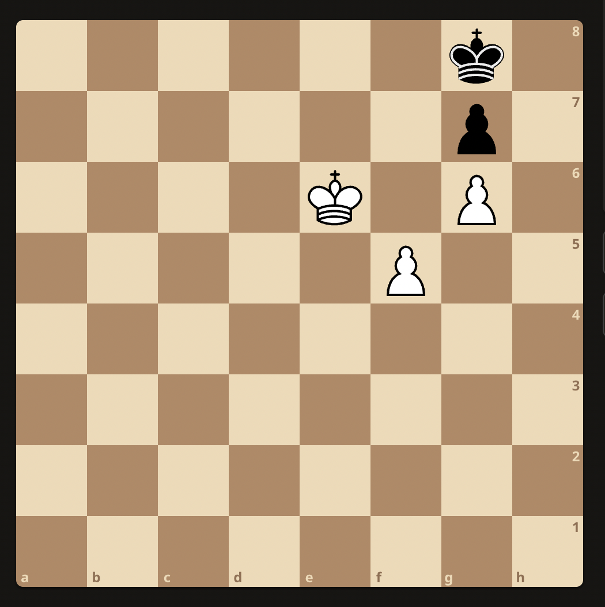

## Chess Fundamentals

### Pawn promotion
White to play:

Ke6 because e6 turns it into a draw.

### Pawn Ending
White to play:

Ke6 because it forces Kh8
1. Ke6 - Kh8
2. f6 - gxf6
3. Kf7 (traps the king but pawn escapes) - f5
4. g7+ - Kh7
5. g8Q+ - Kh6
6. Qg6#   

 
White to play:

