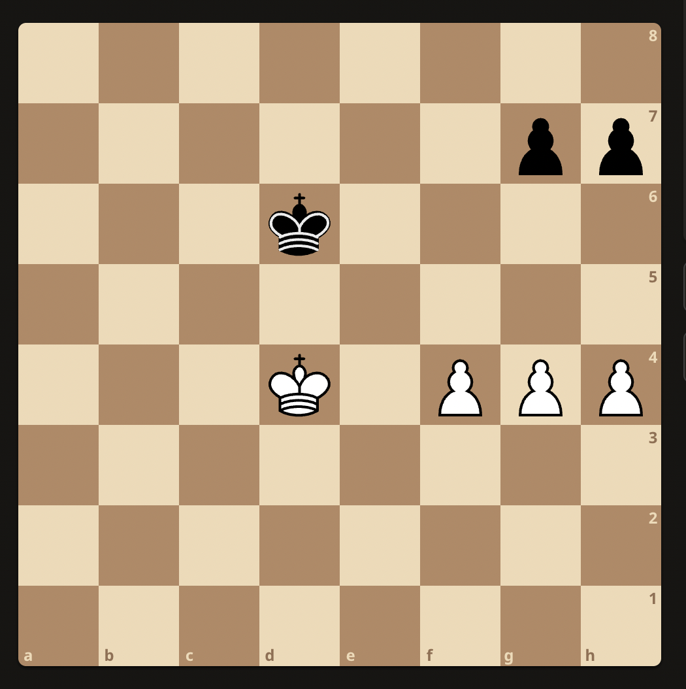
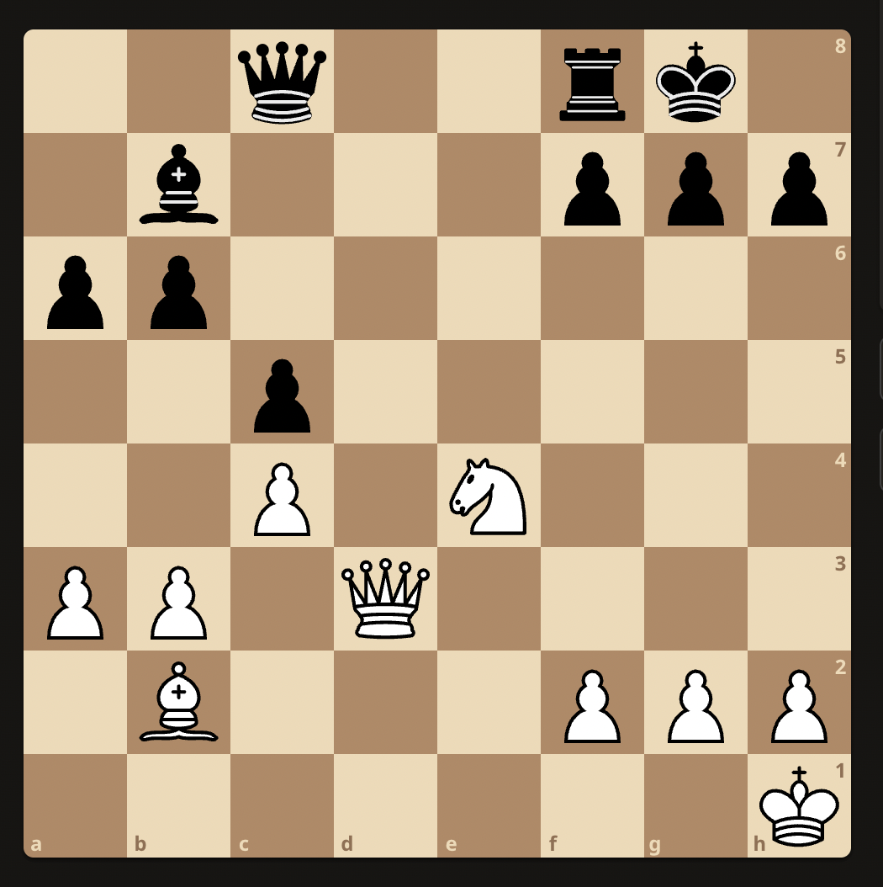

## Chess Fundamentals

### Pawn promotion
White to play:

Ke6 because e6 turns it into a draw.

### Pawn Ending
White to play:

Ke6 because it forces Kh8
1. Ke6 - Kh8
2. f6 - gxf6
3. Kf7 (traps the king but pawn escapes) - f5
4. g7+ - Kh7
5. g8Q+ - Kh6
6. Qg6#   

White to play:

f5 turns it into a draw. Because:
1. f5 - g6
2. fxg6 - Ke6
3. g7 - Kf7
4. Ke4 - Kxg7
5. Kf4 - Kg8
6. g5 - Kg7
7. Kf5 - Kg8
8. g6 - Kg7
9. Kg5 - Kg8
10. Kf6 - Kh8

This results in a locked draw state.    

Winning move here is Ke4 because it supports both the pawn before proceding towards promotion.   

White to play:

White to play:

### Winning middle games

